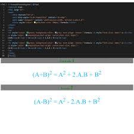
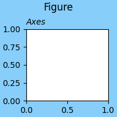

<style>
    .gallery-scroll {
  display: flex;
  flex-wrap: nowrap;
  margin: 0;
  padding: 0;
  scroll-snap-type: x mandatory;
  scroll-behavior: smooth;
  overflow-x: scroll;
}

.gallery-item {
  padding: .5rem;
  font-size: 1.2rem;
  text-align: center;
  background-color: #333;
  color: #d9d9d9;
  scroll-snap-align: center;
}
@media screen and (min-width: 800px) {
  .gallery-scroll {
    flex-wrap: nowrap;
    padding: 1rem 0;
    scroll-snap-type: x mandatory;
    overflow-x: scroll;
    scroll-behavior: smooth;
  }

  .gallery-item {
    scroll-snap-align: start;
  }
}
</style>


# Einführung

Auf dieser Website findet ihr einige Grundlagen wie ihr mit Hilfe von Markdown Text formatieren könnt. Dabei sind hier nur die wichtigsten Befehle aufgeführt (ohne Gewähr).
Dazu werden auch Übliche Python Befehle und die Syntax aufgelistet.

## Grundsätze:

```{sidebar} Git-Repository:
:class: note
Diese Seite hat ein
[Git-Repository](https://github.com/LuMaaAstro/Jupyter-Python-Markdown-Webseite).
Das bedeutet das ihr originalen Jupyter-Notebook Dateien euch runterladen könnt und auch selber Sachen ergänzen könnt wenn ihr wollt.
Auch gibt es dort die Möglichkeit Issues zu eröffnen also Vorschläge wie was besser gemacht werden kann, bzw Probleme die ihr habt.
```

Allgemein sollte man sich an folgende Grundsätze in halten:

1. haltets einfach, aber nicht dumm.
2. wenns einfach geht, NICHT kompliziert machen.
3. mach es so kompliziert wie nötig.
4. Kommentieren ist keine Krankheit, sondern eine Gabe

Markdown wurde extra entwickelt, um sowohl gut auszusehen als auch um in script Form möglichst leserlich zu sein. Es macht also keinen Sinn den "schönen" Markdown code sinnlos zu verschachteln oder mit html sachen umzusetzen, welche genau so gut auch mit der regulären Markdown syntax möglich wären.


Die selben regeln gelten auch Für Python mit dem zusatz der 5. Regel:

5. Wenn du Sachen mehrfach verwendest: mach ne Funktion draus

Die oberen Grundsätze gelten für Python aus den selben gründen wie bei Markdown. Python lässt sich relativ einfach lesen und verstehen. 
Es macht also keinen Sinn den Code unnötig zu verkomplizieren.
Die 5. Regel ist aber sinnvoll, da wenn ihr eure Funktionen sinnvoll bezeichnet, verbessert das die Leserlichkeit des Codes.
Das selbe gilt auch für wiederholungen wenn ein Code immer wieder verwendet wird und sich nur die Indizes verändern, ist es sinnvoll über eine Schleife nachzudenken.


## Kapitel Übersicht:

<div class="gallery-scroll">
    <figure class="gallery-item">
        <figcaption><h3>Mit Markdown anfangen</h3></figcaption>
        <a href="Markdown_Allgemein.html">
            
        </a>
    </figure> 
    <figure class="gallery-item">
        <figcaption><h3> Markdown für Fortgeschrittene </h3></figcaption>
        <a href="html_allgemein.html">
            
        </a>
    </figure>
    <figure class="gallery-item">
        <figcaption><h3>Mathe-Formeln schreiben</h3></figcaption>
        <a href="Mathe_allgemein.html">
            
        </a>
    </figure>
    <figure class="gallery-item">
        <figcaption><h3>Python allgemeines:</h3></figcaption>
        <a href="Python_allgemein.html" title="Hier gehts zum Python Kapitel">
            
        </a>
    </figure>
    <figure class="gallery-item">
        <figcaption><h3>Anfangen mit Plotten</h3></figcaption>
        <a href="Matplotlib_Einführung.html">
            
        </a>
    </figure>
    <figure class="gallery-item">
        <figcaption><h3>Numerische Mathematik mit Numpy</h3></figcaption>
        <a href="Numpy_Einführung.html">
            
        </a>
    </figure>
    <figure class="gallery-item">
    <figcaption><h3>Symbolische Mathematik:</h3></figcaption>
    <a href="Sympy_Einführung.html">
        
    </a>
    </figure>
    <figure class="gallery-item">
        <figcaption><h3>Code Beispiele und Übungen:</h3></figcaption>
        <a href="Matplotlib_Beispiele.html">
            
        </a>
    </figure>
</div>
